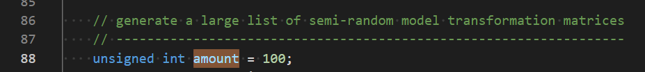

# Rock

+ 北京大学图形学课程小作业示例代码
+ 该用例只是为展示**实例化具体是怎么实现**的
+ 代码修改自 [learnopengl](https://learnopengl.com/Advanced-OpenGL/Instancing)
  + [中文翻译](https://learnopengl-cn.github.io/04%20Advanced%20OpenGL/10%20Instancing/)
+ main.cpp 中，amount 变量表示渲染小石头个数
  + 尝试修改为更大的数值，效果应该差不多

+ 说明：
  + 把 rock 模型用 cube 进行替代了，planet 使用 Tetrahedron 替代（更小，压力更小）
  + 迁移的时候删除了所有纹理相关的内容，显示的时候使用 uv 显示
    + 如果想要添加可以参考[原文](https://learnopengl-cn.github.io/04%20Advanced%20OpenGL/10%20Instancing/)内容
  + obj 的加载过程没有使用 EBO
    + 在渲染时候将 draw call 修改为 `glDrawArray()` 效果是一致的
  + 本次作业不要求添加纹理
  + shader 文件添加到 `data/shader` 文件夹中，在代码中使用 `SAHDER_DIR/shader_name.suffix` 调用

> 注：Assimp是经过裁剪的版本，只支持 **FBX** 文件的导入